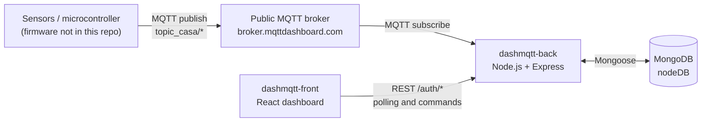

# dashmqtt-back

Back end of **DASHMQTT / HomeBoard**, a home-automation dashboard I built in 2021. It listens to sensor readings sent over MQTT, stores them in MongoDB, and exposes a small REST API that the dashboard uses to show live values, toggle devices and manage automation alarms.

- Dashboard (React): [erickkarl/dashmqtt-front](https://github.com/erickkarl/dashmqtt-front)
- Stack: Node.js, Express 4, MQTT.js, Mongoose 5 / MongoDB

## Architecture



1. A device publishes readings to `topic_casa/...` topics on a public MQTT broker.
2. This service subscribes to those topics and saves each reading in MongoDB with a timestamp.
3. The dashboard polls the REST API (the latest reading once per second) and sends commands: toggle a device, add or delete devices and alarms.
4. A scheduler inside this service evaluates the stored alarms every 60 seconds and flips the matching device's `flag` in MongoDB.

The service never publishes device state back to the broker, and the device firmware is not part of this repository, so how a physical device reads the `flag` values is outside what this code shows.

## MQTT topics

The service connects to `http://broker.mqttdashboard.com` (mqtt.js falls back to plain MQTT over TCP for this URL scheme) and subscribes to:

| Topic | Effect |
| --- | --- |
| `topic_casa/temperatura/medicao` | Payload parsed as a float and saved in `temperaturas` |
| `topic_casa/energia/medicao` | Saved in `energias` (the dashboard labels it in W) |
| `topic_casa/vazao/medicao` | Saved in `aguas` (the dashboard labels it in L/min) |
| `topic_casa/lampada1` | Toggles the `flag` of the device named `Luz Teste` (hard-coded for testing) |
| `topic_casa/ar` | Toggles the `flag` of the device named `Ar Quarto 2` (hard-coded for testing) |
| `topic_casa/temperatura/habilitar` | Subscribed, but no handler is implemented |

## REST API

All application routes are mounted under `/auth`. That prefix is only a route namespace: there is no authentication.

| Method | Route | Body | Returns |
| --- | --- | --- | --- |
| GET | `/auth/sendTemperature` | | `{ user: { DATETIME, value } }` latest temperature |
| GET | `/auth/sendEnergy` | | `{ user: { DATETIME, value } }` latest energy reading |
| GET | `/auth/sendAgua` | | `{ user: { DATETIME, value } }` latest water flow reading |
| GET | `/auth/sendDevices` | | `{ devices: [...] }` |
| GET | `/auth/sendComodos` | | `{ comodos: [...] }` distinct room names |
| GET | `/auth/sendAlarms` | | `{ alarmes: [...] }` |
| POST | `/auth/addDevice` | `deviceName, deviceType, deviceComodo, deviceIcon` | `"recebido"` |
| POST | `/auth/addAlarm` | `alarmDevice, alarmType, alarmTime, alarmIcon, alarmSensor, alarmOnoff, alarmSensorValue, alarmSensorRule` | `"recebido"` |
| POST | `/auth/setDeviceState` | `deviceObjId` | Toggles the device `flag`, echoes the body |
| POST | `/auth/deleteDevice` | `deviceObjId` | Echoes the body |
| POST | `/auth/deleteAlarm` | `alarmObjId` | Echoes the body |

There are also three debug routes at the root, `GET /`, `GET /31` and `GET /teste`. They publish sample values (temperature 26, 31 or 29; energy 540; flow 0) to the topics above, which lets you exercise the whole MQTT-to-database path without hardware.

## Data model

Database `nodeDB`; collections are created by Mongoose. Names are Portuguese: *energia* = power, *agua* = water, *dispositivos* = devices, *alarmes* = alarms, *comodo* = room, *vazao* = flow rate, *potencia* = power.

| Collection | Fields |
| --- | --- |
| `temperaturas`, `energias`, `aguas` | `DATETIME` (Date), `value` (Float) |
| `dispositivos` | `nome` (unique), `type` (`toggle` or `slider`), `icon` (`light`, `ac` or `custom`), `comodo`, `value` (Number), `flag` (Boolean, on/off state) |
| `alarmes` | `dispositivo` (device name), `type` (`time` or `sensor`), `onoff` (`on` or `off`), `icon`, `tempo` (`HH:MM`), `sensor` (`temperatura`, `vazao` or `potencia`), `regra` (`maior`, `menor` or `igual`), `sensor_value` |

### Alarm rules

Every 60 seconds the service loads all alarms and, for each one:

- `time`: if the server's local time (`HH:MM`) equals `tempo`, set the device `flag` to `true` for `on` and `false` for `off`.
- `sensor`: compare the latest reading of the chosen sensor with `sensor_value` using `regra` (`maior` is `>=`, `menor` is `<`, `igual` is `===`) and, if it matches, set the device `flag` the same way.

## Configuration

Nothing is read from environment variables. The settings are constants in the source, and no credentials are stored in the repository:

| Setting | Value | Where |
| --- | --- | --- |
| MongoDB URL | `mongodb://localhost/nodeDB` | `db.js` |
| MQTT broker | `http://broker.mqttdashboard.com` | `index.js` |
| HTTP port | `5000` | `index.js` |

The dashboard expects this API at `http://localhost:5000`.

## Running it

Requirements: Node.js, [Yarn](https://yarnpkg.com/) (the repo is locked with `yarn.lock`), a MongoDB server on `localhost:27017`, and internet access to reach the public MQTT broker.

```bash
git clone https://github.com/erickkarl/dashmqtt-back.git
cd dashmqtt-back
yarn install
node index.js        # package.json has no start script
```

The API is then available at `http://localhost:5000`. Quick check, assuming MongoDB is running:

```bash
curl localhost:5000/teste                 # publishes sample readings over MQTT
curl localhost:5000/auth/sendTemperature  # returns the stored reading
```

To use the toggle topics, create devices named `Luz Teste` and `Ar Quarto 2` first, for example:

```bash
curl -X POST localhost:5000/auth/addDevice -H 'Content-Type: application/json' \
  -d '{"deviceName":"Luz Teste","deviceType":"toggle","deviceComodo":"Quarto 1","deviceIcon":"light"}'
```

## Status and known limitations

This is a 2021 project and is not maintained. It worked for my setup at the time; it is not hardened for production.

- No authentication or input validation on the API, and CORS is open to any origin.
- The MQTT broker is a public one, with no credentials or TLS, so anyone can publish to or read the `topic_casa/*` topics.
- Model files are lowercase (`models/agua.js`) while the code requires `./models/Agua`. That resolves on Windows and default macOS filesystems, but fails on case-sensitive ones such as Linux until the file names or the `require` calls are aligned.
- Some error paths are unhandled: the two toggle topics throw if their hard-coded device does not exist yet, and sensor alarms throw if no reading has been stored yet. On recent Node versions an unhandled rejection stops the process.
- The `test` script in `package.json` is a placeholder; there are no automated tests.

## License

ISC, as declared in `package.json`.
